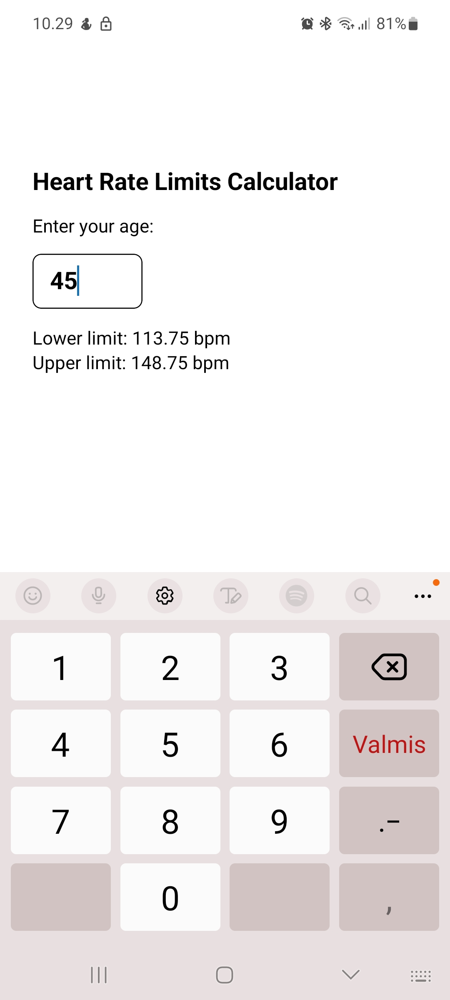

# 💓 Tavoitesyke

Yksinkertainen React Native -sovellus, joka laskee käyttäjän maksimisykkeestä tavoitesykerajat iän perusteella.  
Projektin tarkoituksena on harjoitella React Nativea ja TypeScriptiä.

---

## Toiminnot

- Käyttäjä syöttää ikänsä
- Sovellus laskee **alemman** ja **ylemmän tavoitesykkeen**
- Tarkistus: jos syöte ei ole numero, tulos on 0
- Toteutettu **React Native + TypeScript** -yhdistelmällä

---

## Käytetyt teknologiat

- [Expo](https://expo.dev/)
- [React Native](https://reactnative.dev/)
- [TypeScript](https://www.typescriptlang.org/)
- React Hooks (`useState`)
- `StyleSheet` tyylien hallintaan

---

## Laskentaperiaate

Tavoitesykealue lasketaan kaavalla:

- Maksimisyke == 220 - ikä
- Ala-raja = Maksimisyke x 0.65
- Ylä-raja = Maksimisyke x 0.85

## Näkymä

